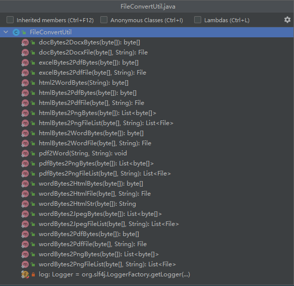

### 一、前言

目前支持：

1. `word` 转 `html`
2. `word` 转 `pdf`
3. `word` 转 `jpeg`
4. `word` 转 `png`
5. `html` 转 `word`
6. `html` 转 `pdf`
7. `html` 转 `png`
8. `doc` 转 `docx`
9. `excel` 转 `pdf`
10. `markdown` 转 `html`
11. `pdf` 转 `word`

### 二、项目地址

[https://gitee.com/zhengqingya/file-convert-util](https://gitee.com/zhengqingya/file-convert-util)

### 三、主要调用工具类

> 具体代码请查看项目示例

---

> 分享语句：
> 生活从来都不容易，总是伴随着一个又一个的坎坷和挑战。 聪明的人，懂得调节自己的情绪，不会被外在事物轻易地影响自己的心情，看淡世间沧桑，内心安然无恙。 说到底，很多人都毁在了自寻烦恼上。如果学会这三点，你将会快乐很多。
